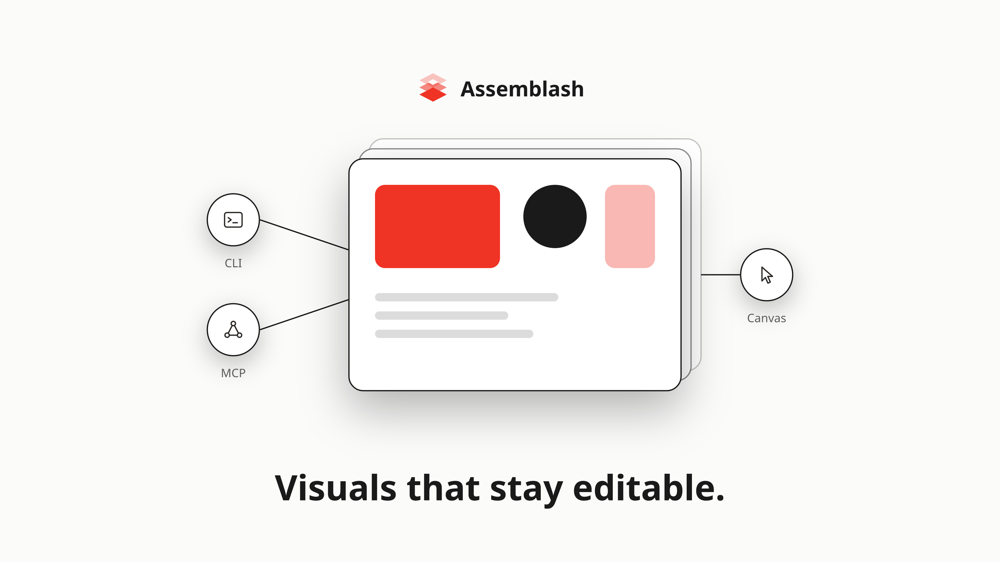

<p align="center">
  
</p>

<h1 align="center">Assemblash</h1>

<p align="center">
  A local-first visual document engine for people, applications, scripts, and AI agents.
</p>

<p align="center">
  <a href="https://github.com/VidGuiCode/assemblash/releases/latest"></a>
  <a href="https://github.com/VidGuiCode/assemblash/actions/workflows/ci.yml"></a>
  <a href="LICENSE"></a>
  
</p>

Assemblash creates structured visual documents from text, images, SVGs, groups,
templates, and reusable styles. The result stays editable: you can inspect the
layer tree, apply a typed operation, undo it, render a preview, and export PNG or
SVG without depending on a cloud service.

It ships as one small executable with a browser-based editor, a command-line
interface, a local HTTP API, an embedded Rust API, and an MCP server. Every
interface goes through the same validated operation layer, so a change made by
an agent behaves like a change made by a person.

**Current release: 1.2.1.** The document schema and operation API have been
stable since 1.0. See the [release notes](https://github.com/VidGuiCode/assemblash/releases/tag/v1.2.1)
or [changelog](CHANGELOG.md) for the full history.

<p align="center">
  
</p>

<p align="center"><sub>Created as a structured Assemblash document and exported by the deterministic renderer. <a href="examples/launch-card">Inspect the editable project.</a></sub></p>

## Why Assemblash?

Visual work usually lands at one of two extremes: a powerful editor that is
hard to automate reliably, or a code/generation pipeline that produces a flat
image nobody can comfortably refine. Assemblash sits in the middle.

- **Structured, not flattened.** Documents keep their layers, groups, assets,
  metadata, templates, and named slots.
- **Local by default.** Creating, editing, rendering, and exporting work
  offline. No account or AI provider is required.
- **Safe to automate.** Mutations are typed, validated, journalled, versioned,
  dry-runnable, and undoable. Protected content stays protected.
- **Deterministic.** The same document, assets, and pinned font files produce
  bit-identical PNGs on all six supported release targets.
- **Easy to embed.** Use the Rust crates, HTTP API, CLI, or MCP server instead
  of driving the reference interface with clicks.

Assemblash is deliberately not a Photoshop, GIMP, or Figma replacement. It is
a focused composition engine for repeatable visual assets, templates, and
agent-assisted workflows.

## Get started

### Download a release

Pick the download that fits your machine from
[GitHub Releases](https://github.com/VidGuiCode/assemblash/releases/latest):

| Platform | Download | Run it |
| --- | --- | --- |
| Windows | `assemblash-<version>-windows-<arch>.exe` | Double-click it. |
| Debian, Ubuntu | `assemblash_<version>_<arch>.deb` | `sudo apt install ./assemblash_<version>_<arch>.deb`, then pick Assemblash from the application menu. |
| macOS | the `.tar.gz` archive | Unpack it, then see the note below before first launch. |
| Anything else | the `.zip` or `.tar.gz` archive | Unpack it and launch `assemblash`. |

The executable is self-contained — the editor is compiled into it — so the
single file is the whole program. The archives and the `.deb` additionally
carry the licence texts and the changelog.

Launching it without arguments creates a local workspace, starts the server,
and opens the editor in your browser. A second launch opens the server that is
already running. You can stop it from the editor.

The macOS binaries are not signed with an Apple Developer ID, so macOS
quarantines them on download and Gatekeeper refuses the first launch. Clear
the flag yourself after unpacking:

```sh
xattr -d com.apple.quarantine ./assemblash
```

A Homebrew tap would remove that step, since Homebrew clears the flag on what
it installs. The formula is written and lives in `packaging/homebrew/`, but
the tap is **not published yet**, so there is no `brew install` to run today.

### Install from source

Building requires [Rust 1.92 or newer](https://www.rust-lang.org/tools/install):

```sh
cargo install --git https://github.com/VidGuiCode/assemblash --tag v1.2.1 assemblash-cli
```

### Create and export from the CLI

Assemblash never substitutes a system font behind your back. Install a font
into a local store once, then use that same store when exporting:

```sh
assemblash font install "Noto Sans" --font-store ./assemblash-fonts
assemblash new ./poster --width 800 --height 400 --background '#f6f4ef'
assemblash add-text ./poster --text "Hello" --font "Noto Sans" --size 64 --x 40 --y 40 --width 720 --height 120
assemblash export ./poster --out poster.png --font-store ./assemblash-fonts
```

Already have a font file? Use `--font /path/to/SomeFont.ttf` or
`--font-dir /path/to/fonts` instead. Run `assemblash --help` or
`assemblash <command> --help` for the complete command reference.

## Platform compatibility

The same six platforms are built, tested, and included in every release:

| Operating system | x86_64 / Intel / AMD64 | ARM64 / AArch64 |
| --- | :---: | :---: |
| Windows | ✅ `.exe`, `.zip` | ✅ `.exe`, `.zip` |
| Linux | ✅ `.deb`, `.tar.gz` | ✅ `.deb`, `.tar.gz` |
| macOS | ✅ Intel `.tar.gz` | ✅ Apple silicon `.tar.gz` |

The `.exe` and `.deb` are new in the 1.2.0 release assets. macOS has no
installer of its own yet — see the note above about the quarantine flag.

The release workflow checks that every binary starts before attaching it. CI
also runs the Rust workspace tests on all six targets. The reference editor
runs in a modern browser and is served by the executable itself.

## What is included

### A structured document engine

- Canvas dimensions and background settings
- Text, raster image, SVG, and nested group layers
- Position, size, rotation, scale, opacity, visibility, and ordering
- Stable IDs, metadata, locking, duplication, grouping, and ungrouping
- Alignment, centering, distribution, snapping, bounds, and overlap queries
- JSON persistence with unknown-field preservation
- Named presets, templates, slots, and deterministic variant batches

A project remains ordinary, portable files:

```text
my-project/
├── document.json
├── assets/
└── history/
```

You can inspect and hand-edit `document.json`. Normal edits should still go
through an Assemblash interface so they are validated and recorded in history.
The published contracts live in [`schema/`](schema/).

### Rendering and export

Assemblash converts a document to SVG as a pure function and rasterizes it with
`resvg` and `tiny-skia`. It supports PNG export, compatible SVG export,
configurable output dimensions, fourteen deterministic blend modes, and a
non-destructive effect stack for brightness, contrast, saturation, blur, and
seeded grain.

Fonts are loaded only from files you explicitly provide or install into the
font store. Their bytes are hashed and pinned, which keeps typography and
export pixels consistent across operating systems.

### History and safety

Every mutation uses the same transactional operation layer. A refused
operation leaves the document unchanged. Successful operations are journalled
with their actor and transaction ID and can be undone or redone across
restarts.

- Expected-version checks prevent stale clients from overwriting newer work.
- Dry run shows what a supported mutation would do without committing it.
- `locked`, `protected`, and `readOnly` layers are enforced in the engine, not
  just hidden behind UI controls.
- Project and asset paths stay inside the configured filesystem boundary.
- Imported SVGs are sanitized before they enter the asset store.

## Choose the interface that fits

| Interface | Best for | Start with |
| --- | --- | --- |
| Reference editor | Creating and refining documents visually | Launch `assemblash` |
| CLI | Shell scripts and straightforward local workflows | `assemblash --help` |
| HTTP API | Applications and custom frontends | `assemblash serve` |
| MCP server | AI agents and MCP-compatible clients | `assemblash mcp` |
| Rust crates | Embedding the engine directly | [`crates/`](crates/) |

The editor is a reference client, not a privileged implementation. Its edits,
the CLI, HTTP requests, and MCP tools all compile to the same operations.

Most MCP clients can start Assemblash with this configuration:

```json
{
  "command": "assemblash",
  "args": ["mcp"]
}
```

Add `--project /path/to/project` to expose one project instead of the workspace.
The MCP server provides read tools for documents, layers, validation, history,
and rendered previews, plus mutation tools with dry run, version checks,
protection checks, and undo transaction IDs.

For agents working from a repository checkout, a reusable public skill is in
[`skills/assemblash/SKILL.md`](skills/assemblash/SKILL.md). It explains the
document-first workflow and the guarantees an integration must preserve.

## How the pieces fit together

```text
Reference editor ───────┐
CLI and scripts ────────┼──> API / typed operations ──> document + history
Custom applications ───┤              │
AI agents via MCP ──────┘              └──────────────> renderer + export
```

The API and MCP server do not contain their own document logic. They are
adapters over `assemblash-core`, which owns validation and operations;
`assemblash-renderer` owns rendering; and the server, MCP, and CLI crates expose
those capabilities to different clients.

The implementation is Rust with a TypeScript reference interface. The
executable embeds the built interface, so users do not need Node.js. The
official `scratch` container image is about 9 MB.

## Local use and self-hosting

`assemblash serve` listens on `127.0.0.1` by default and needs no configuration:

```sh
assemblash serve
```

A non-loopback bind refuses to start without an access token:

```sh
assemblash token show
assemblash serve --bind 0.0.0.0
```

The token authenticates requests; it does not encrypt traffic. Put Assemblash
behind a TLS reverse proxy when it is reachable beyond a trusted network. See
[DEPLOYMENT.md](DEPLOYMENT.md) for Docker, Caddy, Traefik, nginx, and identity
provider guidance.

## Stability and current limits

Assemblash 1.x makes two compatibility promises:

1. A document written by 1.0 remains readable by every 1.x release.
2. A client written against the 1.0 operation API keeps working across 1.x.

Breaking either contract requires a major release and a documented migration.
Additive fields use defaults, and unknown document fields survive load and save.

The important limits are stated plainly:

- Styled text runs are not implemented yet.
- AI image/provider adapters do not ship and are out of scope for the core.
- Fourteen blend modes are supported. `color-dodge` and `color-burn` are
  refused because they are not bit-identical across every target.
- Built-in authentication is one shared token. Accounts, roles, OIDC, SSO,
  TLS, and per-user audit identity belong in a reverse proxy.
- The editor is intentionally a reference client rather than a complete
  professional design application.

For the product scope and design rationale, read [PRD.md](PRD.md). For the
precise changes in each release, read [CHANGELOG.md](CHANGELOG.md).

## Try it and tell us what you find

Assemblash is released and the core contracts are stable; the useful next step
is seeing it in real workflows. If you try it, the project would genuinely
benefit from hearing what you made, what felt smooth, and what got in your way.

- Share a workflow, result, or question in
  [GitHub Discussions](https://github.com/VidGuiCode/assemblash/discussions).
- Report reproducible problems with the
  [bug form](https://github.com/VidGuiCode/assemblash/issues/new?template=bug_report.yml).
- Propose a focused addition with the
  [feature form](https://github.com/VidGuiCode/assemblash/issues/new?template=feature_request.yml).

Security problems are the exception: report those privately as described in
[SECURITY.md](SECURITY.md).

## Develop and contribute

Clone the repository and run the Rust checks from its root:

```sh
cargo fmt --all --check
cargo clippy --workspace --all-targets --all-features -- -D warnings
cargo test --workspace
```

The TypeScript project is inside `ui/`—there is intentionally no root
`package.json`:

```sh
cd ui
npm ci
npm run check
```

`ui/dist/` is committed because the Rust binary embeds it. After changing the
interface, `npm run build` must leave that directory up to date.

Before proposing a change, please read [CONTRIBUTING.md](CONTRIBUTING.md). It
explains the stability rules, testing expectations, and the line between the
generic engine and downstream adapters. Security problems should be reported
privately as described in [SECURITY.md](SECURITY.md), never as public issues.

Useful project documents:

| Document | What it covers |
| --- | --- |
| [PRD.md](PRD.md) | Scope, requirements, invariants, and product decisions |
| [CONTRIBUTING.md](CONTRIBUTING.md) | Contribution and review expectations |
| [DEPLOYMENT.md](DEPLOYMENT.md) | Tokens, Docker, TLS, and reverse proxies |
| [SECURITY.md](SECURITY.md) | Supported releases and private reporting |
| [DEPENDENCIES.md](DEPENDENCIES.md) | Dependency and license inventory |
| [CHANGELOG.md](CHANGELOG.md) | Release-by-release history |

Assemblash is licensed under the [Apache License 2.0](LICENSE). The public
repository contains only the generic engine and neutral examples; private
brand kits, credentials, customer assets, and downstream workflows belong
outside it.
